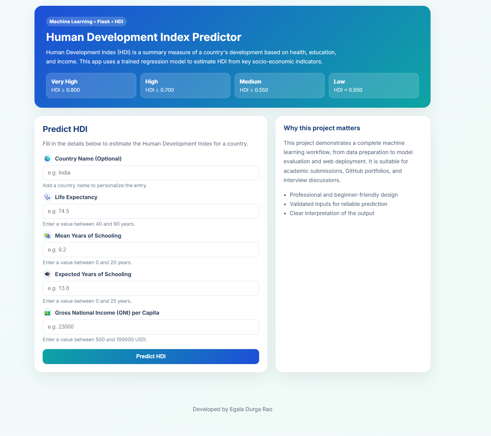
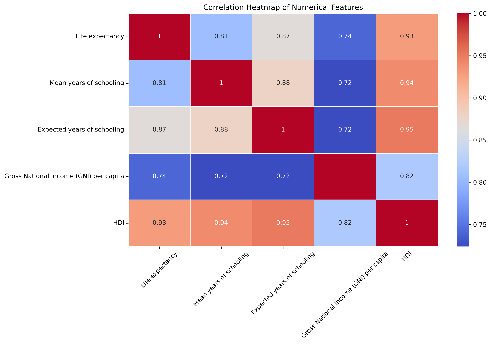
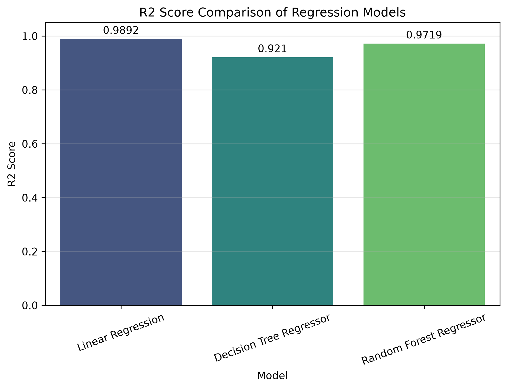
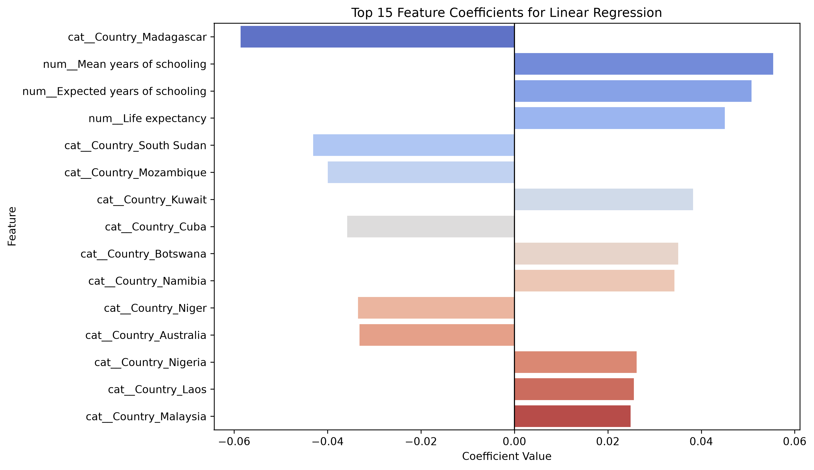
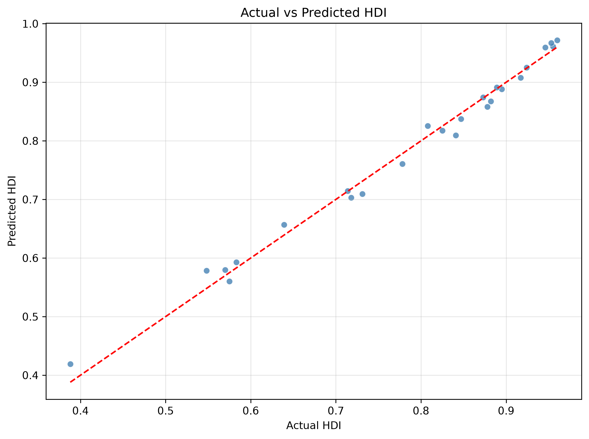
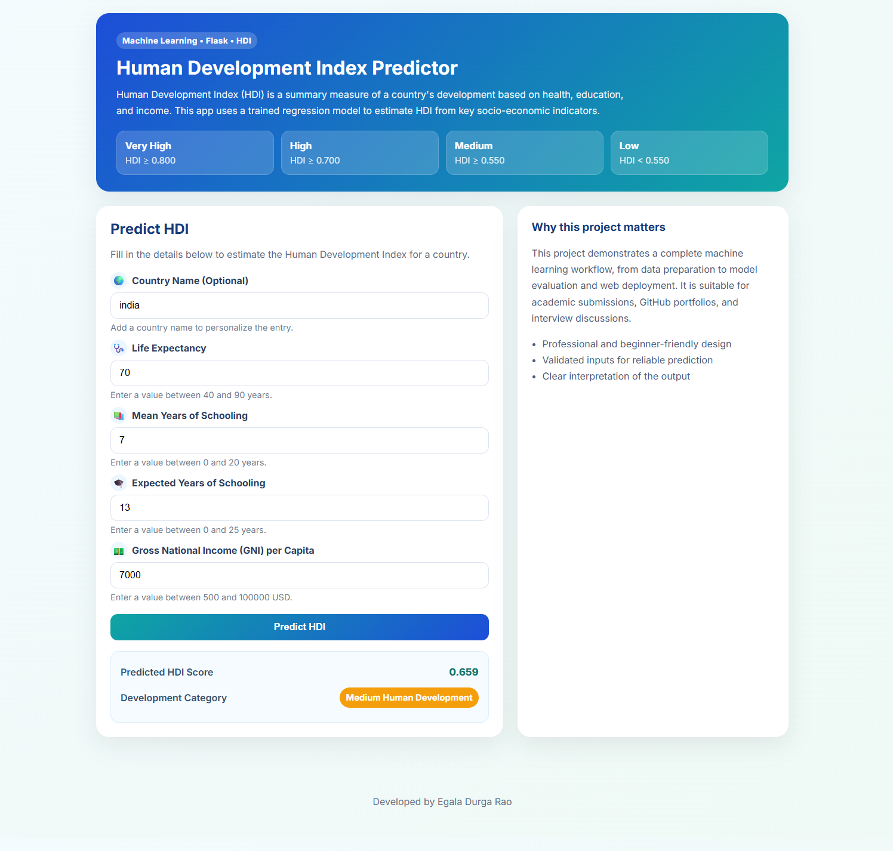

<div align="center">

# Human Development Index (HDI) Prediction Using Machine Learning

A professional machine learning project for predicting the Human Development Index (HDI) using socio-economic features and a trained Linear Regression model.


> ⭐ Beginner Friendly • Machine Learning • Flask • Portfolio Project

<p align="center">
  
</p>

</div>

---

## 📚 Table of Contents

- [Project Overview](#-project-overview)
- [Features](#-features)
- [Project Workflow](#-project-workflow)
- [Technologies Used](#-technologies-used)
- [Machine Learning Algorithm](#-machine-learning-algorithm)
- [Dataset Information](#-dataset-information)
- [Installation](#-installation)
- [How to Run the Flask Application](#-how-to-run-the-flask-application)
- [Project Highlights](#-project-highlights)
- [Project Demo](#-project-demo)
- [Project Folder Structure](#-project-folder-structure)
- [Sample Prediction](#-sample-prediction)
- [Screenshots](#-screenshots)
- [Future Improvements](#-future-improvements)
- [Learning Outcomes](#-learning-outcomes)
- [Author](#-author)
- [License](#-license)

---

## 🎯 Project Overview

This project aims to predict the Human Development Index (HDI) of countries using machine learning. HDI prediction is useful for understanding development trends, comparing countries, and analyzing the relationship between social and economic indicators.

---

## ✨ Features

- Data preprocessing
- Exploratory Data Analysis (EDA)
- Correlation heatmap
- Histograms
- Feature importance
- Linear Regression model
- Model comparison
- Flask web application
- HDI prediction
- Responsive user interface
- Input validation
- Model serialization using Joblib

---

## 🔄 Project Workflow

```text
Dataset
↓
Exploratory Data Analysis
↓
Data Preprocessing
↓
Train-Test Split
↓
Model Training
↓
Model Evaluation
↓
Model Comparison
↓
Feature Importance
↓
Save Model
↓
Flask Web Application
↓
HDI Prediction
```

---

## 🛠 Technologies Used

| Technology | Purpose |
| --- | --- |
| Python | Core programming language |
| Pandas | Data manipulation and analysis |
| NumPy | Numerical computing |
| Matplotlib | Data visualization |
| Seaborn | Statistical plotting |
| Scikit-learn | Machine learning and model evaluation |
| Flask | Web application development |
| HTML | Frontend structure |
| CSS | Styling and responsive design |
| Joblib | Model serialization |

---

## 🤖 Machine Learning Algorithm

Linear Regression was selected because it is simple, interpretable, and effective for predicting a continuous target such as HDI. Decision Tree Regressor and Random Forest Regressor were also compared to evaluate predictive performance.

| Model | R² Score |
| --- | ---: |
| Linear Regression | 0.9892 |
| Decision Tree Regressor | 0.9210 |
| Random Forest Regressor | 0.9719 |

**🏆 Best Model: Linear Regression** achieved the best performance in this project.

---

## 📂 Dataset Information

- **Dataset Name:** HDI Dataset
- **Number of Records:** 124
- **Target Variable:** HDI
- **Input Features:**
  - Country
  - Life Expectancy
  - Mean Years of Schooling
  - Expected Years of Schooling
  - Gross National Income (GNI) per Capita

---

## ⚙ Installation

```bash
git clone <repository-url>

cd HDI-Prediction-Using-ML

pip install -r requirements.txt
```

---

## 🚀 How to Run the Flask Application

```bash
cd App

python app.py
```

Open the application in your browser:

```text
http://127.0.0.1:5000/
```

---

## ✨ Project Highlights

- ✅ Machine Learning Project
- ✅ Flask Web Application
- ✅ Linear Regression Model
- ✅ Model Comparison
- ✅ Feature Importance Analysis
- ✅ Responsive UI
- ✅ Input Validation
- ✅ GitHub Portfolio Ready

---

## 📊 Project Statistics

| Metric | Value |
| --- | --- |
| Dataset Size | 124 Records |
| Number of Features | 5 |
| Target Variable | HDI |
| Best Performing Model | Linear Regression |
| R² Score | 0.9892 |
| Web Framework | Flask |
| Programming Language | Python |

---

## 🎮 Project Demo

Users can open the Flask application and interact with the prediction form to estimate HDI values using real-world socio-economic inputs. The app supports input validation, shows the predicted HDI score, and displays the corresponding development category in a clean and beginner-friendly interface.

---

## 📁 Project Folder Structure

```text
HDI-Prediction-Using-ML
│
├── Dataset/
│      HDI.csv
│
├── Notebook/
│      HDI_Model.ipynb
│
├── Model/
│      HDI_LinearRegression_Model.pkl
│
├── App/
│      app.py
│      templates/
│      static/
│
├── Images/
│
├── requirements.txt
│
├── README.md
│
└── LICENSE
```

---

## 📈 Sample Prediction

| Input | Value |
| --- | --- |
| Country | India |
| Life Expectancy | 70 |
| Mean Years of Schooling | 7 |
| Expected Years of Schooling | 13 |
| GNI per Capita | 7000 |

**Predicted HDI:** approximately **0.68**

**Development Category:** Medium Human Development

---

## 📸 Screenshots


<p align="center">
  
  
</p>

<p align="center">
  
  
</p>

<p align="center">
  
  
</p>

---

## 🚀 Future Improvements

- [ ] Deploy on AWS
- [ ] Deploy on Render
- [ ] Dockerize the application
- [ ] Create a Streamlit version
- [ ] Implement XGBoost
- [ ] Perform Hyperparameter Tuning
- [ ] Train on a Larger Dataset
- [ ] Enable Real-time HDI Prediction
- [ ] Develop a REST API
- [ ] Add User Authentication

---

## 📚 Learning Outcomes

- [x] Data Cleaning
- [x] Exploratory Data Analysis
- [x] Feature Engineering
- [x] Machine Learning
- [x] Model Evaluation
- [x] Model Comparison
- [x] Flask Deployment
- [x] GitHub Project Management

---

## 👨‍💻 Author

<div align="center">

<p align="center">

<a href="YOUR_GITHUB_LINK">

</a>

<a href="YOUR_LINKEDIN_LINK">

</a>

<a href="mailto:YOUR_EMAIL">

</a>

</p>

**Egala Durga Rao**

B.Tech Computer Science and Engineering (Data Science)

</div>

---

## 📜 License

This project is released under the MIT License.
